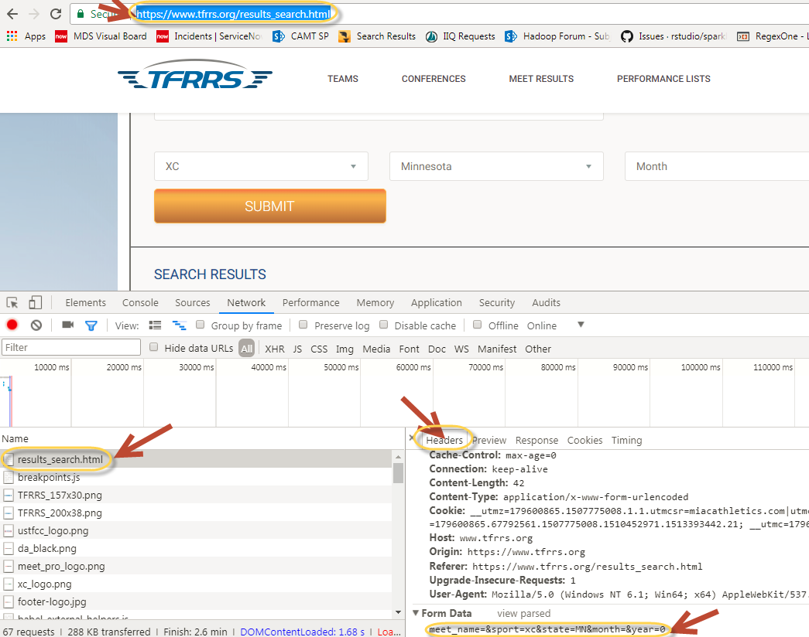

## *Selecting results to scrape*

The [TFRRS](https://www.tfrrs.org/results_search.html) website maintains NCAA cross country and track results going back to 2012. With a built in search functionality and fairly consistent result pages this was the most logical place to pull our data. From the search page provided we could filter for cross country meets in Minnesota, with a goal of targeting results containing MIAC schools as that was our focus. This search returned a list of links to result pages for all Minnesota cross country meets where we could pull results.  To get the data we wanted we had to run multiple scraping jobs.

### *Step 1*
The first task was to collect the list of result pages. To collect this list we need to hit the search page with the criteria of minnesota and xc. By default the search results page does not display the form parameters in the url as query strings, but luckily they exist in the header behind the scenes.  To validate what to pass as query string parameters for the form, open your browser, open the dev tools, run the search with the Minnesota as the state and sport as xc.  Once the search results are returned, click the "Network" tab in the dev tools, then lick on the search_results.html to view the headers associated to the request. In the "Headers" tab, scroll down to "Form Data", click "View Parsed", and finally you'll see the query string that's passed with the request, *meet_name=&sport=xc&state=MN&month=&year=0*.  Now we can create the URL we need to scrape the results page: https://www.tfrrs.org/results_search.html?page=0&title=1&go=1&state=mn&sport=xc

Here's a screenshot of working with devtools in the browser.


To scrape the links we use the read_html() function from the xml2 package. Once we hit the page we simply grab all of the html a nodes, loop through the nodes to grab the href and save the links to a table for our next scraping job.  Use the code below to try scraping for yourself or download the list of [result links](https://drive.google.com/file/d/0B9SgBxZJr9hoOHBSRHc5T3ZKYTg/view?usp=sharing) we scraped.  *The page has changed slightly since we scraped and results now appear on multiple pages instead of one.  This adds a little more complexity.  Additional work would need to be done to pull the results from all result pages.*


```{r setup, include=FALSE}
knitr::opts_chunk$set(echo = TRUE)
library(rvest)
library(dplyr)
library(magrittr)
library(tidyverse)
library(jsonlite)
library(stringr)
library(xml2)
library(XML)
library(rvest)
library(tidyverse)
library(httr)
library(httpuv)
library(RCurl)
```


```{r, eval=FALSE}
#Scrape the data from this page: https://www.tfrrs.org/results_search.html?page=0&title=1&go=1&state=mn&sport=xc to get links to the individual result links then scrape those

flag <- 0
df <- NULL
resultLinks <- NULL
resultList <- read_html("https://www.tfrrs.org/results_search.html?page=0&title=1&go=1&state=mn&sport=xc")

links <- resultList %>% 
  html_nodes("#results_search a")


for(i in 1:length(links)) {
  
  link <- links[i] %>% 
    html_attrs() %>% 
    toString()
 
  df <- tibble(link)

  if(flag == 0) {
    resultLinks <- df
  } else {
    resultLinks <- rbind(resultLinks,df)
  }
  
  flag <- 1
   
}

#Create the full url for the next srape job
resultLinksClean <- resultLinks %>% 
  mutate(link = gsub("(www)","https://www",link),
         link = as.character(link))

#Write to csv to have a backup
write.csv(resultLinksClean,"resultLinks.csv")


```

### *Step 2*

In the second scraping job we will use the links we scraped in the first job to hit each result page and pull back results from individual meets. To do this we run a loop on the list of link we scraped, again using read_html() to get each page.  For each page we hit we can easily pull the meet name, meet date, meet location, start time (this has been removed since we scraped) and race name.  To get the individual results consisting of the athlete name, time, score, race distance, gender, score, team and class year we have to grab the set of tables on the result page and loop through the table rows and columns to pull the information we want.  

In most cases the tables alternated, women first, team results followed by individual results, followed by the same for men.  In the code we look at the number of tables on the page and create a list of the table locations where the results are.  We're then able to grab the table row and column information.  View the code below or try running it for yourself.  

```{r, eval=FALSE}
resultLinksClean <- read.csv("resultLinks.csv")

#This result page was found to cause errors as it didn't fit our scraping template.  Since it did not contain results relevant to our project, i.e. no MIAC schools, we chose to exclude this link.  
resultLinks <- resultLinks %>%
  mutate(link=as.character(link)) %>% 
  filter(link!="https://www.tfrrs.org/results/xc/4714.html")

miac_women_xc<-data.frame()
 
for (url in resultLinks$link) {
#Sample for starting at a later point in the result list if a link failed
#for (url in (92:99)) {
#Sample for rescraping a specific pages
#for (url in c("https://www.tfrrs.org/results/xc/12042.html","https://www.tfrrs.org/results/xc/8459.html")) {
  
    #This is for testing purposes, when changes are made and you don't want to run the whole loop, 
    #just test on the first link.
    #url=resultLinks$link[1]
  
    #read the page 
    page <- read_html(url)
    
    #Retrieve meet name
    meet_name <-
      page %>%
      html_nodes(".title a") %>%
      html_text()
    
    #Retrieve meet date
    meet_date <-
      page %>%
      html_nodes(".datelocation li:nth-child(1)") %>%
      html_text()
    meet_date_short<-substr(meet_date,start=6,stop=14)
    
    #Retrieve meet location
    meet_location <-
      page %>%
      html_nodes(".datelocation li:nth-child(2)") %>%
      html_text()
    meet_location_short<-substr(meet_location,start=12,stop=(nchar(meet_location) - 4))
    meet_location_short = gsub("(\n)|(\nCity Not Supplied,)",", ",meet_location_short)
    
    start_time <-
      page %>%
      html_node("div:nth-child(12) span") %>%
      html_text()
    start_time = gsub("(\n)*(\t)*","",start_time)
    
    race <- page %>% 
      html_nodes("a+ div div")
    
    #Last table on page contains womens results
    tables <- page %>% 
      html_nodes("table")
    
    #Create the list of tables that have the individual results we want
    #Note for special case - Subtract 1 for the augsburg oddness 
    lastTableLocation <- length(tables)
    
    tableList = c(lastTableLocation)
    tableRef = lastTableLocation - 2
    #Note for rescraping the pages that dont't have team results, i.e. fewer tables than the job expects
    #tableRef = lastTableLocation - 1
    #while(tableRef >= 3) {
    while(tableRef >= 4) {
      tableList=c(tableRef,tableList)
      #Note for rescraping the pages that dont't have team results
      #tableRef = tableRef - 1
      tableRef = tableRef - 2
    }
    
    for(t in (1:length(tableList))) { 
      
      race_group=""
      if (length(race[t] %>% html_text()>0)) {
        race_group = race[t] %>% html_text()
        race_group = gsub("(\n)*(\t)*","",race_group)
      } 
      
      #Loop through first 7 td divs in the table
      tableRows <- tables[tableList[t]] %>% 
        html_nodes("tr")
      
      for(row in (1:length(tableRows))) {
        
        tableDivs <- tableRows[row] %>% 
          html_nodes("td")  %>% 
          html_nodes("div")
        
        if(length(tableDivs)>0) {
        
         # Retrieve place
          women_place <- tableDivs[1] %>%
            html_text()
          
          # Retrieve and inspect full names
          women_name <- tableDivs[2] %>%
            html_text()
          women_name_short = gsub("(\n)*(\t)*","",women_name)
      
          # Retrieve and inspect class year
          women_class_year <- tableDivs[3] %>%
            html_text()
      
          # Retrieve and inspect team
          women_team <- tableDivs[4] %>%
            html_text() 
          women_team_short = gsub("(\n)*(\t)*","",women_team)
          #women_team_short<-substr(women_team,start=10,stop=nchar(women_team))
      
          # Retrieve and inspect avg. mile
          women_avg_mile <- tableDivs[5] %>%
            html_text()
          
          # Retrieve time
          women_time <- tableDivs[6] %>%
            html_text()
          
          # Retrieve score
          women_score <- tableDivs[7] %>%
            html_text()
          
          
          meet_info <- 
            tibble(meet_name = meet_name, meet_date = meet_date_short, meet_location = meet_location_short, start_time=start_time, race_group=race_group, place = women_place, name = women_name_short, class_year = women_class_year, team = women_team_short, avg_mile = women_avg_mile, time = women_time, score = women_score, url=url)
        
          #store the temp values into the master dataframe
          miac_women_xc<-rbind(miac_women_xc, meet_info)
        }
      }
    }
    #Print the URL to the console so if the job fails on a bad page or the connection fails due to the length of time it    
    #takes the job to run, you can restart the job at the url you left off on and continue adding data to the tibble. 
    print(url)
} 

write.csv(miac_women_xc, "raceResults.csv")

```

### *Step 3*

Repeat! As we alluded to, this process is not perfect.  Not all result pages exactly matched the template we counted on to scrape the data.  After looking through results we could pick out result sets that did not make sense.  Upon investigation these odd pages fell into a few categories.  One being the results listed individual results then team results, therefore we needed an alternate set of tables.  Comments are included in the code above to assist with scraping these.  There were a few other oddities dealt with on a case by case basis.  As we reran results we replaced results with the clean results, finally ending up with a decent consistent data set.

Later in the project we realized there were a couple Wisconsin meets that several MIAC teams competed at, so we scraped an additional set of wisconsin data. We were able to use the same code above, but manually created the list of 10 links we wanted to scrape.  

Unfortunately some very important results were not available on TFRRS.  We found that the MIAC Conference results for 2013 were actually a copy of the 2014 conference results.  After having no luck reaching out to TFRRS to get this updated, we had to manually paste the data into a text file to get the data added to our data set as the data was not included as html on the page.  

After many go arounds we finally felt we had a fairly complete set of data and we were ready for more in depth data cleansing and wrangling.  In the future it would be great to find a source of data prior to 2012 but that may prove impossible.  

